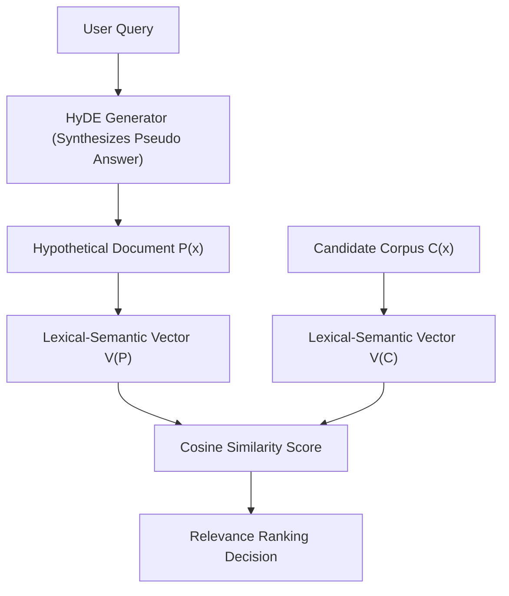

# genpark-hyde-hypothetical-document-embeddings-skill

Agent Skill implementing **HyDE (Hypothetical Document Embeddings)** query expansion and vector matching in 100% Python standard library.

## Architectural Flow

